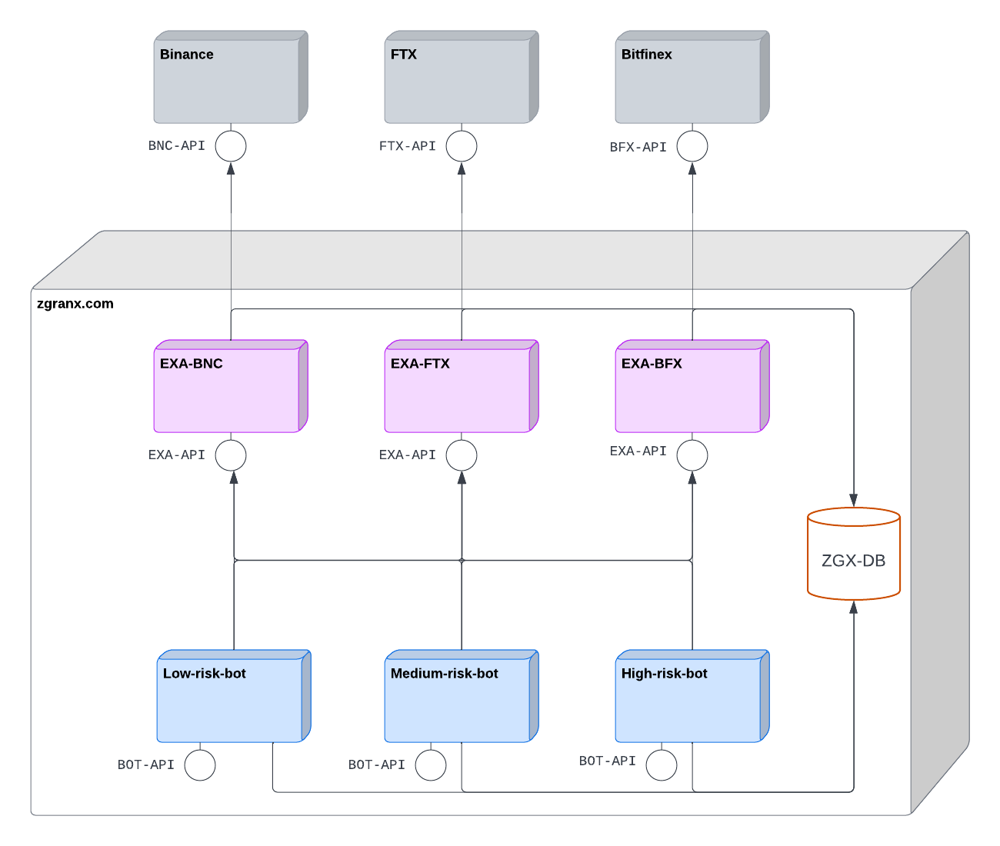

# T-801 - smart crypto trading

## high-level design




## references

1. [6 of The Best Crypto Trading Bots Strategies](https://blockgeeks.com/guides/6-of-the-best-crypto-trading-bots-strategies-updated-list/)
1. [Relative Strength Index (RSI) Indicator for Crypto Trading](https://goodcrypto.app/relative-strength-index-rsi-indicator-for-crypto-trading-an-ultimate-guide-by-good-crypto/)
1. [Exponential Moving Average: How to Use EMA to Trade Volatile Crypto](https://learn.bybit.com/indicators/exponential-moving-average-ema-crypto/)
1. [Most Commonly-Used Periods in Creating Moving Average (MA) Lines](https://www.investopedia.com/ask/answers/122414/what-are-most-common-periods-used-creating-moving-average-ma-lines.asp)


## data sources

1. [coingecko API](https://www.coingecko.com/en/api/documentation)
1. [https://www.cryptodatadownload.com/data/](https://www.cryptodatadownload.com/data/)


## local database

For development purposes you will want to run a local instance of the price database. This is accomplished as follows

1. `source set-env`
1. `make dockerinit`
1. `make pdbinit`

Now you have a local price database running -- `make pdbprompt` will give you a `mysql` shell. That database is empty though.

Assuming you have a data snapshot in `/tmp/snapshot/T-801/` you can populate it with 5-minute candle data (using the data import tool (`dit`)) as follows:

```
make
for ds in binance ftx gateio huobi; do bin/dit pod --dsource $ds --period 5M --fpath /tmp/snapshot/T-801/$ds; done
```

This will give you 5-minute candles (for btc, eth, bnb, ada, sol, dot, avax, matic and ltc versus usdt) from `2022-07-26` to today.

Have fun :-)

Please note: the database content resides in the `/tmp` directory and will thus be wiped every time you restart. If you want a more permanent copy you need to change the `pdbdir` in the `Makefile`.

## back testing

For back testing purposes we need price data that goes back 6 - 12 months. Such data can be obtained from [cryptodatadownload.com](https://www.cryptodatadownload.com/data/) and loaded into the database as follows:

```
bin/ldd Binance_ETHUSDT_2022_minute.csv
```

## production database

We have a `mariadb` instance running in production that

* is being updated with candle data ([OHLC](https://www.investopedia.com/terms/o/ohlcchart.asp)) every 5 minutes
* has 1-minute candle data for btc and eth going back as far as `2021-01-01`
